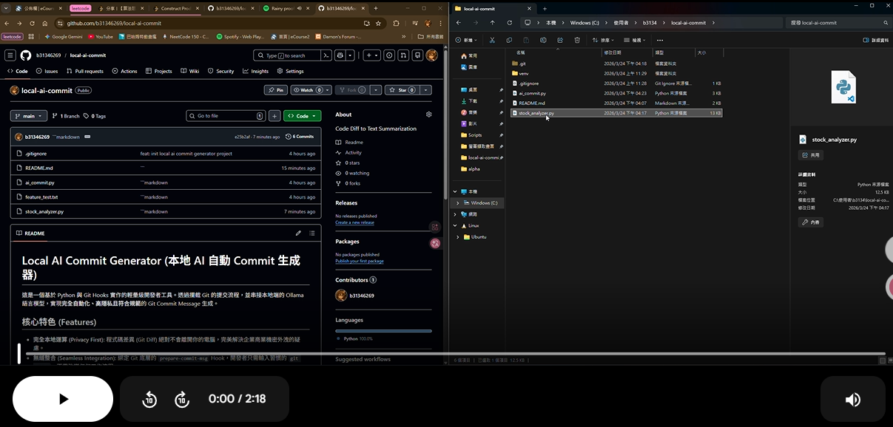

#  Local AI Commit Generator (本地 AI 自動 Commit 生成器)

這是一個基於 Python 與 Git Hooks 實作的輕量級開發者工具。透過攔截 Git 的提交流程，並串接本地端的 Ollama 語言模型，實現**完全自動化、高隱私且符合規範**的 Git Commit Message 生成。

## 核心特色 (Features)

* **完全本地運算 (Privacy First):** 程式碼差異 (Git Diff) 絕對不會離開你的電腦，完美解決企業商業機密外洩的疑慮。
* **無縫整合 (Seamless Integration):** 綁定 Git 底層的 `prepare-commit-msg` Hook，開發者只需輸入習慣的 `git commit`，不需改變任何工作流程。
* **標準化輸出 (Standardized):** 強制 AI 遵守 Conventional Commits 規範 (如 feat, fix, refactor 等)，保持專案歷史紀錄的整潔與易讀性。
* **推論:** 採用開源的專門程式碼模型 `qwen2.5-coder:7b`，在本地端取得速度與精準度的最佳平衡。

## 系統架構與運作原理 (Architecture)

1. 開發者執行 `git commit`。
2. Git 觸發 `.git/hooks/prepare-commit-msg`。
3. Bash 腳本啟動 Python 虛擬環境並執行 `ai_commit.py`。
4. Python 透過 `subprocess` 獲取 `git diff --cached` 的程式碼變動。
5. 將 Diff 組合進 Prompt，透過 REST API 發送給背景運作的 **Ollama** 本地伺服器。
6. 模型回傳生成的 Commit Message，Python 將其寫入 `.git/COMMIT_EDITMSG`。
7. 開發者的預設編輯器 (如 VS Code 或 Vim) 自動開啟，呈現 AI 寫好的 Commit 訊息供最後確認。

## 快速開始 (Getting Started)

### 前置作業 (Prerequisites)
* 安裝 [Git](https://git-scm.com/)
* 安裝 [Python 3.x](https://www.python.org/)
* 安裝 [Ollama](https://ollama.com/)

### 1. 下載本地 AI 模型

請開啟終端機，執行以下指令下載輕量級程式碼模型：
```bash
ollama run qwen2.5-coder:7b
```
下載完成後輸入 /bye 退出對話模式，請保持 Ollama 軟體在背景執行
[](https://drive.google.com/file/d/1VsSo3RzOd8mr2ZZQl_GIDnm2lLQWrKzY/view?usp=sharing)

